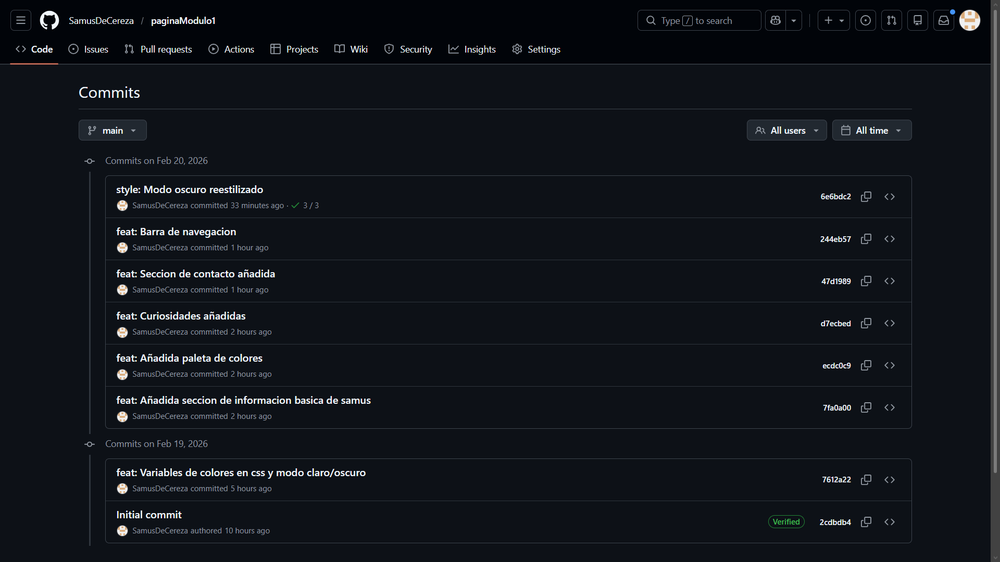
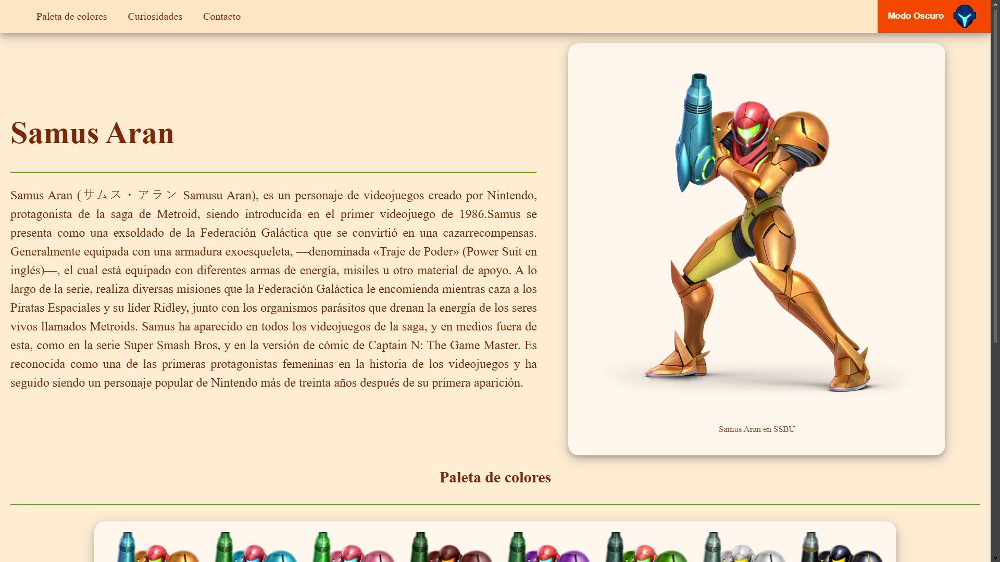
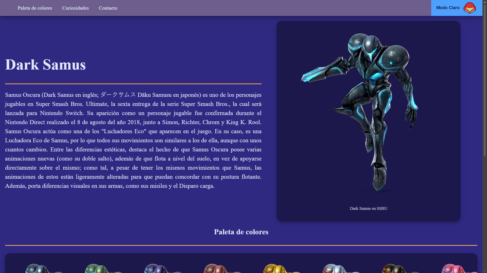

---

# ╔══════════════════════════════════════╗
# ║             Evidencias               ║
# ╚══════════════════════════════════════╝

---

Recopilacion de las evidencias requeridas para la entrega del proyecto: capturas de pantalla y enlaces.

---

## Ubicación de las evidencias

Todas las imágenes se encuentran dentro de la carpeta:

    ./evidencias

---

##  Historial de Commits

---

## Despliegue en GitHub Pages

---

## Pagina en modo claro

---

## Pagina en modo oscuro

---

## Link de la pagina desplegada

`https://samusdecereza.github.io/paginaModulo1/`

# ╔══════════════════════════════════════╗
# ║            Aprendizajes              ║
# ╚══════════════════════════════════════╝

---

## ¿Qué fue lo más fácil y lo más retador?

### Lo más fácil

Inicializar el repositorio y clonarlo

---

### Lo más retador

Escoger un tema para la pagina, no sabia de que tema hacerlo, y se me ocurrio hacerlo de mi personaje favorita de 
Super Smash Bros, que justamente tiene una contraparte oscura, y encajo perfecto con el tema claro y oscuro de la pagina

---

## ¿Qué etiquetas semánticas usaste y por qué?

Utilice
-nav
-main
-section
-footer

Utilice esas porque realice una barra de navegacion, utilice los main como contenedores grandes, y dentro utilice 
section para separar secciones, y footer para el pie de pagina. No vi necesario usar article porque la pagina
no tiene tanta profundidad. Y al usar estas etiqutas semanticas le da accesibilidad y SEO favorable a la pagina.

---

##  ¿Cómo organizaste tus commits?

Se me complica llevar un orden en los commits, no se definir que tanto avance requiere realizar un commit, asi que trate de enfocarme en los cambios notables, como secciones nuevas, funcionalidades (modo oscuro/claro), etc.

---

## ¿Qué mejorarías en la siguiente iteración?

Un diseño mas responsivo, que se adapte mejor a diferentes resoluciones, y tenga mayor precision en el tamaño de contenedores e imagenes